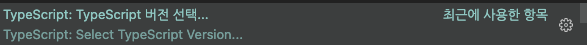
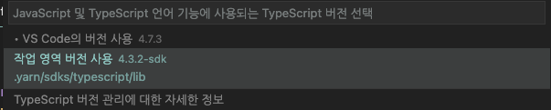

# nest-next-monorepo

## 과제

- [ ] Yarn workspace 모노레포 구성
- [ ] 프론트엔드, 백엔드 모노레포 구성
- [ ] 변경된 서비스만 추적
- [ ] 개발 환경 인프라 셋업 (Docker Compose)
- [ ] Prisma, Yarn v2 호환
- [ ] 배포 환경 테스트

## 개발 환경 셋업

```bash
nvm use # .nvmrc에 명시된 node 버전 설치
corepack enable # corepack 활성화
corepack prepare --activate # package.json에 명시된 버전으로 변경
```

### VSCode

  


### WebStorm

https://memostack.tistory.com/287
